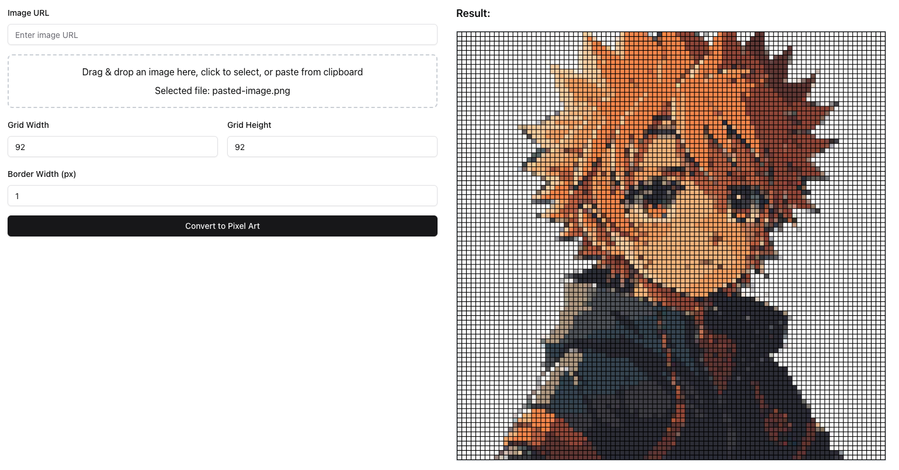

# Pixel Art Grid Generator

This is a web-based application built using Vite, React, TypeScript, Shadcn, and Tailwind CSS. It allows users to create pixel art grids from images with ease. You can input an image via URL, paste an image, or drag and drop it into the interface. Based on the image's resolution, a pixel grid is generated that can be customized in various ways, such as adjusting the grid dimensions and border size.

## Features

- **Multiple Image Input Options**: 
  - Input an image URL.
  - Paste an image from the clipboard.
  - Drag and drop an image directly into the interface.
  
- **Dynamic Grid Generation**: Automatically generates a grid based on the image resolution.

- **Responsive Adjustments**: 
  - Change the width of the grid to automatically adjust the height proportionally, and vice versa.

- **Customizable Borders**: Allows users to customize the border size of each pixel in the grid.

- **Live Preview**: On clicking the "Generate" button, a preview of the pixel art is displayed on the side.

- **Pixel**: Select between different pixel shapes, including:
    -  Square
    -  Circle
    -  Hexagon
    
- **Download** : After generating pixel art, you can download it as a PNG file with a single click using the `Download` icon.


## Preview


## Usage

1. Clone the repository:
   ```bash
   git clone https://github.com/thefallenmerc/pixel-art-grid-generator.git
